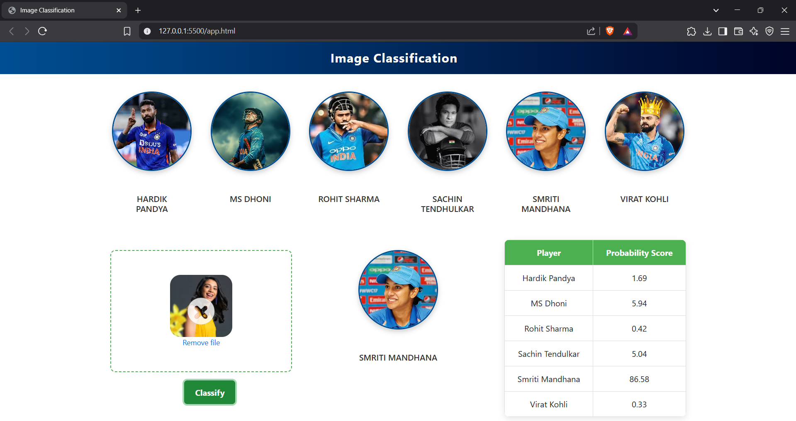
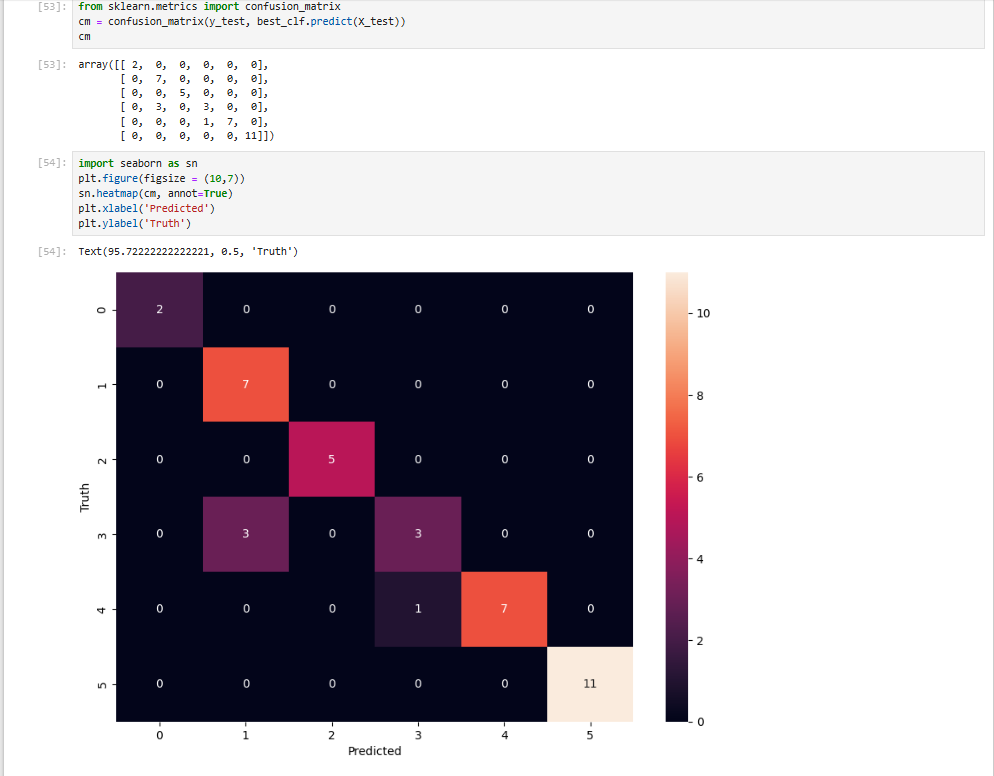

#  Cricket Player Image Classifier using Classical ML

This project is a mini machine learning application that classifies **Indian cricket players** based on facial images. It uses **classical machine learning (SVM)** instead of CNN and is built with a simple, intuitive web interface using Flask.

---

##  What This Project Does

- Preprocesses and crops images to detect face and eyes using OpenCV Haar cascades
- Extracts features using **Discrete Wavelet Transform (DWT)**
- Trains three classifiers: **Support Vector Machine (SVM)**, **Logistic Regression**, and **Random Forest**
- Evaluates each model using confusion matrix and accuracy score
- Saves the best-performing model (`saved_model.pkl`) and label map (`class_dictionary.json`)
- Allows image upload in a browser with prediction and class probability display

---
## 📓 View Model Training Code

You can view the complete model training code in the Jupyter Notebook:

👉 **[Open `cricket_player_classifier.ipynb`](model/cricket_player_classifier.ipynb)**

This notebook includes all the steps:
- Image preprocessing
- Feature extraction
- Model training
- Accuracy and confusion matrix
- Model saving

---
##  Cricketers Trained

- Hardik Pandya  
- MS Dhoni  
- Rohit Sharma  
- Sachin Tendulkar  
- Smriti Mandhana  
- Virat Kohli

---

##  Screenshots

> Make sure to upload screenshots in your repo (rename to `screenshot1.png`, `screenshot2.png` etc.)

  
*Classification results on uploaded image*

  
*Training result – Confusion Matrix*

---

##  Tools & Technologies Used

- **Python 3**
- **Flask** for backend web application
- **OpenCV** for face and eye detection
- **PyWavelets** for feature extraction
- **scikit-learn** for machine learning algorithms
- **HTML, CSS, JS** for frontend
- **Jupyter Notebook** for model training

---

##  Folder Structure

```
Cricket-Player-classifier/
│
├── model/
│   ├── cricket_player_classifier.ipynb     # Notebook for training and evaluation
│   ├── saved_model.pkl                     # Final trained model
│   └── class_dictionary.json               # Label mapping
│
├── server/
│   ├── server.py
│   ├── util.py
│   └── wavelet.py
│
├── ui/
│   ├── app.html
│   ├── app.css
│   ├── app.js
│   ├── dropzone.min.css
│   └── dropzone.min.js
│
├── requirements.txt
├── README.md
└── screenshot1.png
```

---

##  How to Run

```bash
pip install -r requirements.txt
python server/server.py
```

Open the browser at `http://127.0.0.1:5000` and upload a face image.

---

##  Note
- Model is trained using a limited dataset (cropped player images)
- No CNN or deep learning involved
